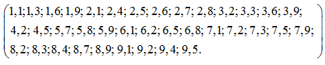
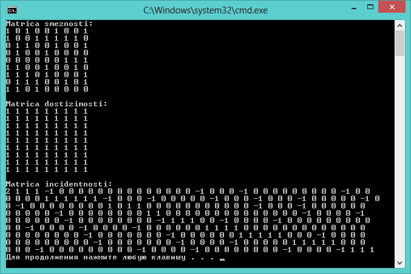
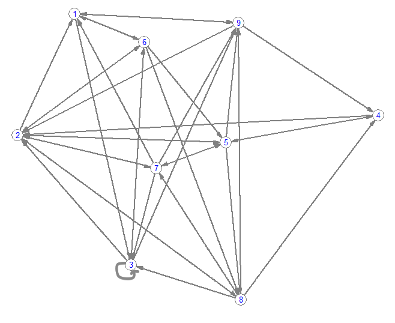

### Condition (Task)
Написать программу, определяющую матрицы смежности, инцидентности и достижимости для заданного графа. В отчете к лабораторной работе представить графическую интерпретацию графа. Каждый граф задан парами смежных вершин.

### Results

