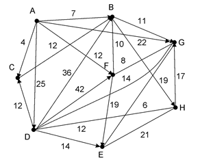
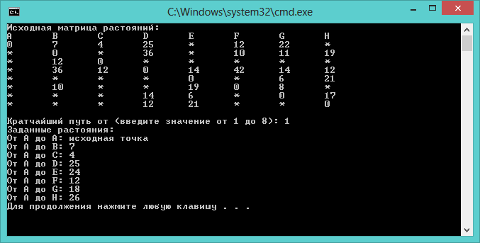

### Condition (Task)
Написать программу, реализующую алгоритм Дейкстры, найти кратчайшие пути на графе от заданной вершины к остальным. Для реализации программы необходимо исходный граф представить в виде матрицы весов.

### Results
