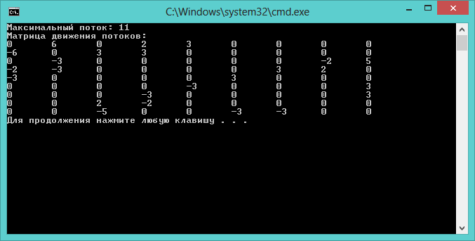

### Condition (Task)
Цель работы: Реализация алгоритма Форда-Фалкерсона для сетей. Вершина   — начало транспортной сети, из которой дуги только выходят. Вершина z — конец транспортной сети, в которую дуги только входят. На множестве дуг  задана целочисленная функция с(и) > О, где с(и) — пропускная способность дуги.
Потоком по транспортной сети называется целочисленная функция

Input.txt
0 6 0 2 3 0 0 0 0
0 0 3 6 0 0 0 0 0
0 0 0 0 0 0 0 0 7
0 0 0 0 5 0 5 5 0
0 0 0 0 0 3 0 0 0
0 0 0 0 0 0 3 0 3
0 0 0 0 2 0 0 5 3
0 4 4 0 0 0 0 0 0
0 6 0 2 3 0 0 0 0

### Results
