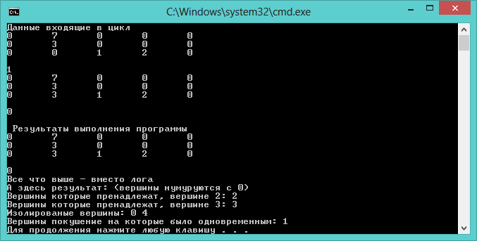

### Condition (Task)
1. С клавиатуры вводится квадратная матрица произвольной размерности (альтернативный вариант генерируется).
Размерность: количество вершин графа. Эта матрица является матрицей весов графа (т.е. все элементы д/б не отрицательны). 
2. Вводятся 2 начальных вершины.
3. Итерационным процессом строятся 2 дерева при помощи метода ближайшего соседа. 
4. Если на одной итерации вершина является ближайшей к 2-м деревьям, она объявляется спорной и не относится ни к одному из них. 
5. Вывести получившиеся графы, спорные вершины и изолированные вершины.

### Results
