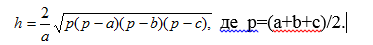
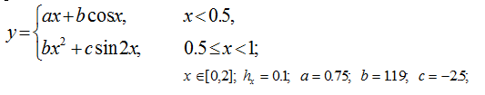

Programming

## 1st semester
### Lab 1
Обчислити висоти ha   hb  ,hc трикутника АВС за формулою

Для  приведених  нижче  варіантів  необхідно  скласти програму обчислення значення функцій  при різних значеннях аргументів, заданих інтервалом зміни і величиною кроку.

### Lab 2
Знайти найменші елементи у кожному рядку матриці та номер максимального з них.

### Lab 3
1.	У тексті слово "країна " замінити словом "Україна".

### Lab 4
Враховуючи інформацію про результати сесії групи, надрукувати список студентів, які будуть отримувати стипендію.

### Lab 5
Створити функцію знаходження мінімального елемента квадратної матриці і сортування ії головної діагоналі.

### Lab 6
Описать структуру с именем STUDENT, содержащую следующие поля:
- фамилия и инициалы;
- номер группы;
- успеваемость (массив из пяти элементов).
Написать программу, выполняющую следующие действия:
- ввод с клавиатуры данных в массив, состоящий из десяти структур типа STUDENT; записи должны быть упорядочены по возрастанию номера группы;
- вывод на дисплей фамилий и номеров групп для всех студентов, включенных в массив, если средний балл студента больше 4.0;
- если таких студентов нет, вывести соответствующее сообщение.

## 2nd semester
### Lab 1
В одномерном массиве, состоящем из вещественных элементов, вычислить:
1) сумму отрицательных элементов массива;
2) произведение элементов массива, расположенных между максимальным и минимальным элементами.
Упорядочить элементы массива по возрастанию.

### Lab 2
Описать структуру с именем STUDENT, содержащую следующие поля:
- фамилия и инициалы;
- номер группы;
- успеваемость (массив из пяти элементов).
Написать программу, выполняющую следующие действия:
- ввод с клавиатуры данных в массив, состоящий из десяти структур типа STUDENT; записи должны быть упорядочены по возрастанию номера группы;
- вывод на дисплей фамилий и номеров групп для всех студентов, включенных в массив, если средний балл студента больше 4.0;
- если таких студентов нет, вывести соответствующее сообщение.
Выполнить варианты заданий лабораторной работы при условии что исходные данные хранятся в текстовом файле.
Исходные данные необходимо записать также в бинарный файл. Результаты обработки исходных данных необходимо сохранить в текстовый, бинарный файл, а также вывести на экран в удобном для пользователя виде.
Вывод исходной информации в поток оформить в виде функции.

### Lab 3
Дана целочисленная прямоугольная матрица. Определить:
1)  количество строк, не содержащих ни одного нулевого элемента;
2)  максимальное из чисел, встречающихся в заданной матрице более одного раза.

### Lab 4
Описать структуру с именем STUDENT, содержащую следующие поля: - фамилия и инициалы;
- номер группы;
- успеваемость (массив из пяти элементов). Написать программу, выполняющую следующие действия:
- ввод с клавиатуры данных в массив, состоящий из десяти структур типа STUDENT; записи должны быть упорядочены по возрастанию номера группы;
- вывод на дисплей фамилий и номеров групп для всех студентов, включенных в массив, если средний балл студента больше 4.0;
- если таких студентов нет, вывести соответствующее сообщение.
Определить операции ++, --, >, +, (), приведение к типу int, а также перегрузить операции работы с потоком для структуры студент.

### Lab 5
Дана целочисленная прямоугольная матрица. Определить:
1)  количество строк, не содержащих ни одного нулевого элемента;
2)  максимальное из чисел, встречающихся в заданной матрице более одного раза.

Кроме того каждый разрабатываемый основной класс должен реализовывать:
1. конструктор по умолчанию
2. деструктор
3. конструкторы с параметрами
4. конструктор копирования
5. перегруженную операцию присваивания

Реализовать следующие методы:
1.заполнение данных случайным образом;
2.сортировку указанной строки матрицы.

### Lab 6
Создать шаблонный базовый класс содержащий одномерный шаблонный массив.
Определить конструктор по умолчанию, конструктор с параметрами и конструктор копирования.
Деструктор должен быть виртуальным.
В базовом классе определить чисто виртуальные методы ввода и вывода.

Создать класс наследник, в котором указано, что массив является массивом структур с именем STUDENT, содержащая следующие поля: 
- фамилия и инициалы;
- номер группы;
- успеваемость (массив из пяти элементов).
Переопределить функции ввода и вывода.

Реализовать в виде методов следующие действия:
- ввод с клавиатуры данных в массив, состоящий из десяти структур типа STUDENT;
- вывод на дисплей фамилий и номеров групп для всех студентов, включенных в массив, если средний балл студента больше 4.0;
- вывод на дисплей фамилий и номеров групп для всех студентов, включенных в массив, если средний балл студента больше заданного, если таких студентов нет, вывести соответствующее сообщение.