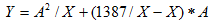
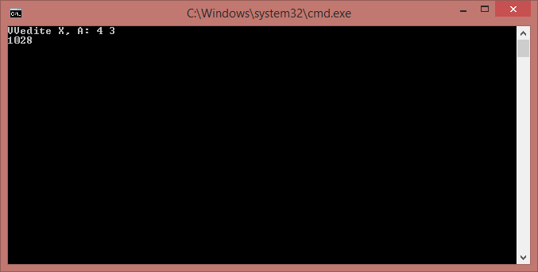

### Condition (Task)
Приведенные примеры нужно оформить как ассемблерные вставки в программы на языке С ++. Ввод, вывод и описание переменных надо выполнить на С ++.
Введите текст программы с помощью произвольного текстового редактора, рекомендуется в качестве разделителя полей команд использовать символ табуляции.
Наладьте программу и выполните ее. Получите распечатка текста и результатов работы программы.

Вычислить , при X> 0, иначе Y = 0.

### Results
