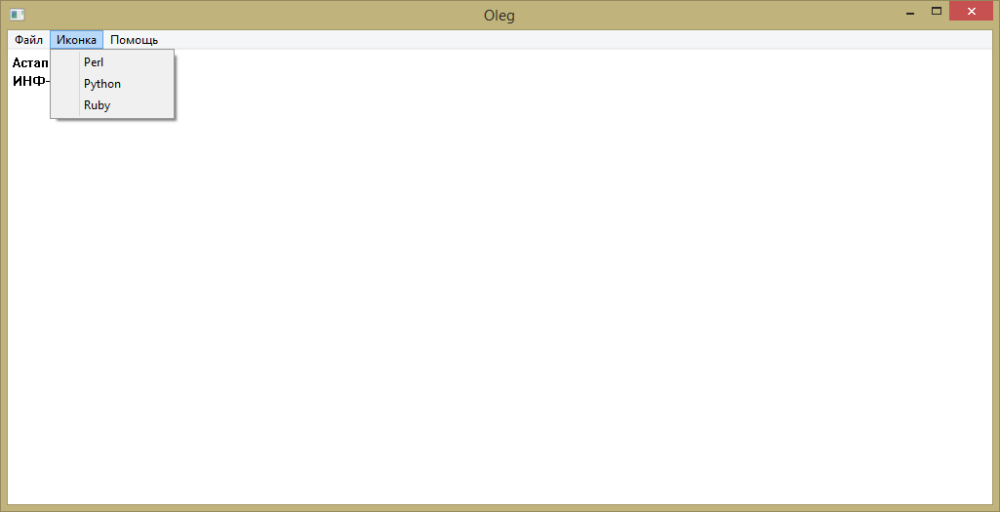
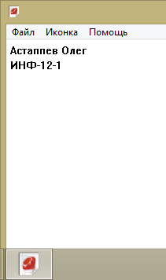
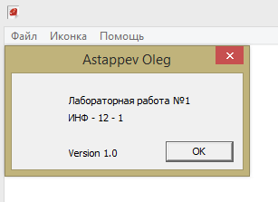
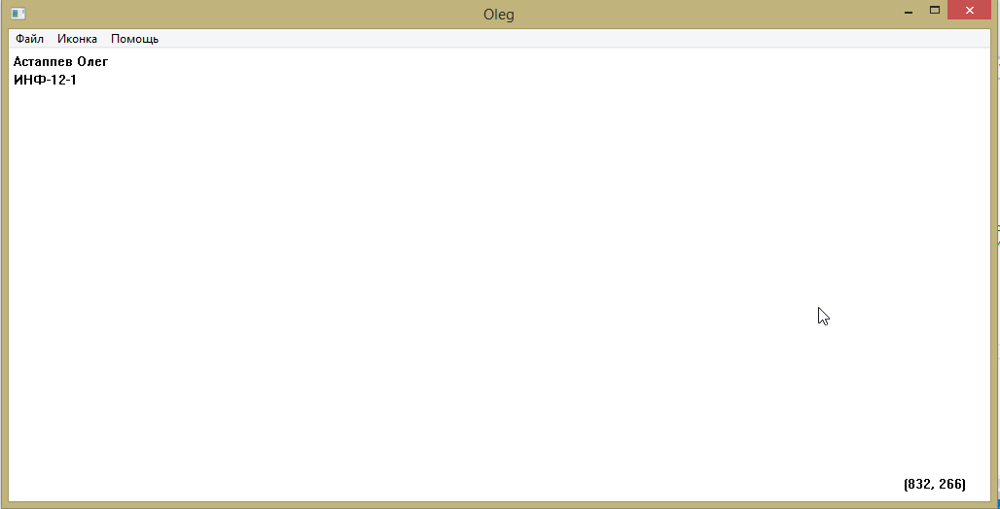
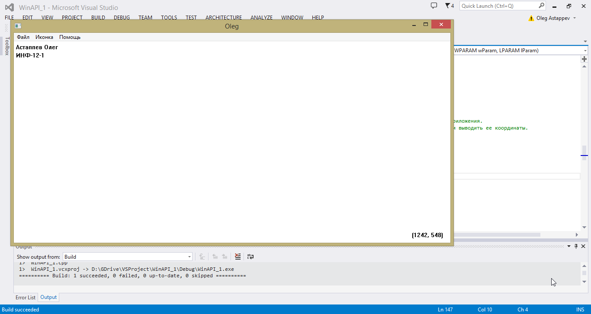

### Condition (Task)
#### Lab 5
Стиль класса:  выравнивание клиентской области по горизонтали;
Тип загружаемой иконки:  IDI_APPLICATION,
Тип загружаемого курсора: IDC_ARROW,
Цвет фона окна: БЕЛЫЙ,
Имя класса окна: имя студента (на английском языке).
Стиль окна:
	а) окно имеет заголовок и обрамляющую рамку;
	б) WS_OVERLAPPEDWINDOW.
Позиция окна: по умолчанию.
Создать три своих иконки в файле ресурсов. При помощи пунктов меню организовать смену иконок в заголовке окна и в трейе приложения. Программа должна содержать меню, в котором есть пункт "О программе", выбрав который, пользователь получает информацию о создателе программы.

#### Lab 6
1 Написать программу, которая следит за перемещением указателя мыши и выводит его координаты в окне приложения.
Если при выходе за окно правая кнопка мыши нажата, программа продолжает следить за перемещением мыши и выводить ее координаты.

### Results
#### Lab 5

#### Lab 6

