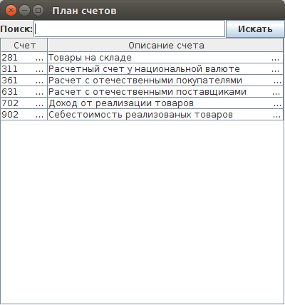

#Book keeping (Бухгалтерский учет)

## Tech
* Java - program language
* PostgreSQL - DB server
[see code (Git repository)](https://github.com/astappev/Storehouse)

## Models

[more...](schemas)

## Screenshots

