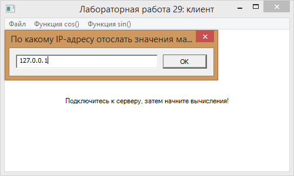
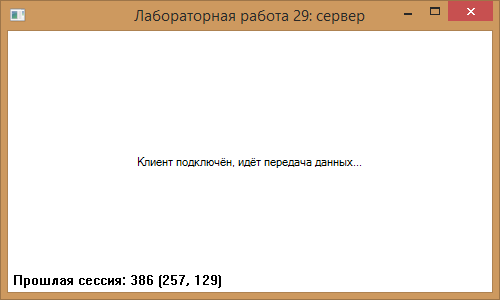
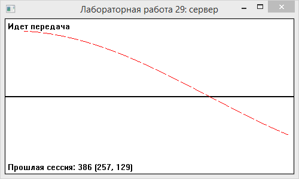
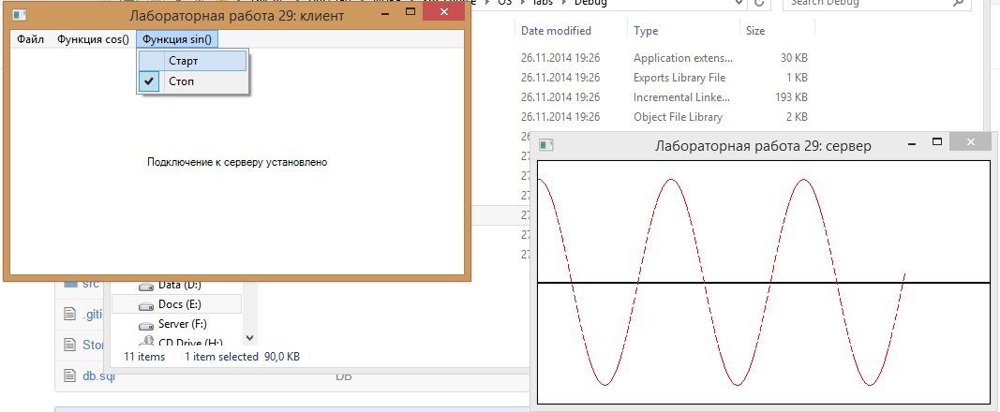
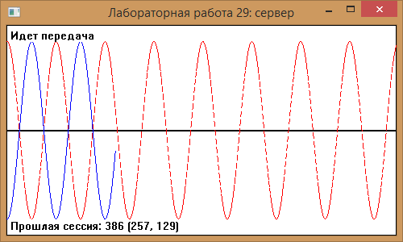
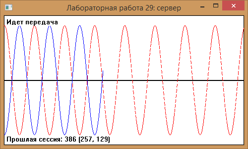
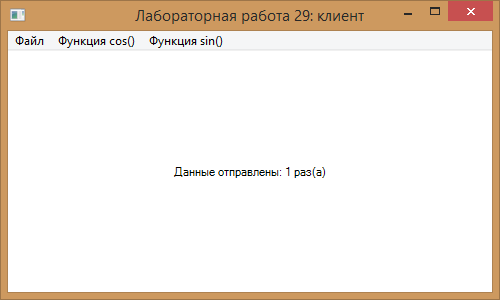
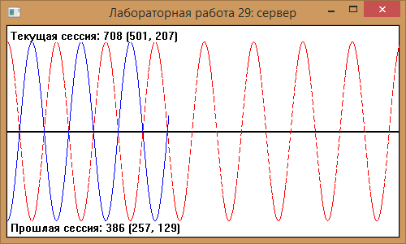

#Operating Systems

### Labs
Необходимо разработать приложение, в котором при нажатии на комбинацию клавиш Ctrl+A запускается первый поток, Ctrl+B – второй поток. При этом в первом потоке начинают вычисляться значения функции y=sin(x), а во втором потоке – значения функции y=cos(x). Генерируемые данные передаются по локальной сети по протоколу TCP/IP в другое приложение, которое принимает данные и отображает их на одном графике линиями разного цвета и текстуры. При нажатии комбинации клавиш Ctrl+N должна останавливаться передача данных в первых двух потоках и второе приложение должно вывести количество данных, поступившее для каждого графика. Эти данные должны быть сохранены в реестр и должна быть возможность просмотра этих данных до тех пор, пока не будут запущены снова два потока, которые сгенерируют новые последовательности данных.

# Results

