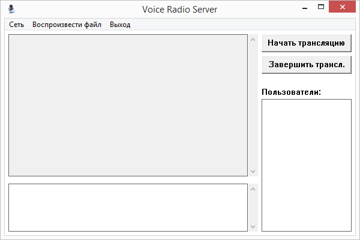
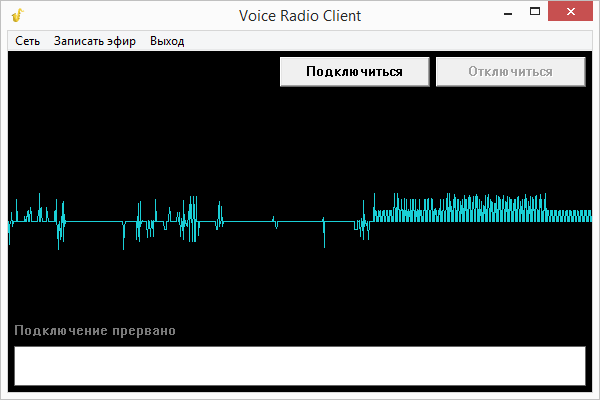

Данная система состоит из серверного приложения, клиентского приложения и приложения «Радиоведущего». Серверное приложение устанавливается на одном компьютере в локальной сети, а клиентские приложения - на других компьютерах. Приложение Радиоведущего устанавливается также на отдельном компьютере или на том же компьютере, что и серверное приложение. Задача серверного приложения состоит в том, чтобы транслировать звук всем клиентским приложениям, а также передавать отзывы о передаче в приложение. Клиентское приложение позволяет подключиться к серверу, прослушать текущую «программу», посмотреть «Программу передач», отправить отзыв о передаче (оценка + текстовое сообщение). Приложение Радиоведущего подключается к серверу и позволяет пользователю передавать звук всем подключенным клиентам (голос радиоведущего и музыка из музыкальных файлов), создавать «Программу передач», смотреть отзывы пользователей.

### Screenshots

