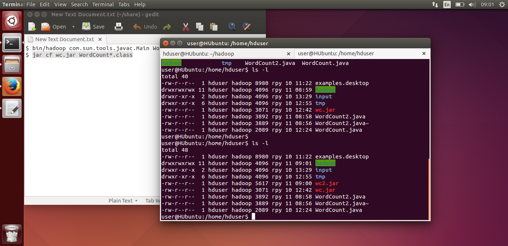
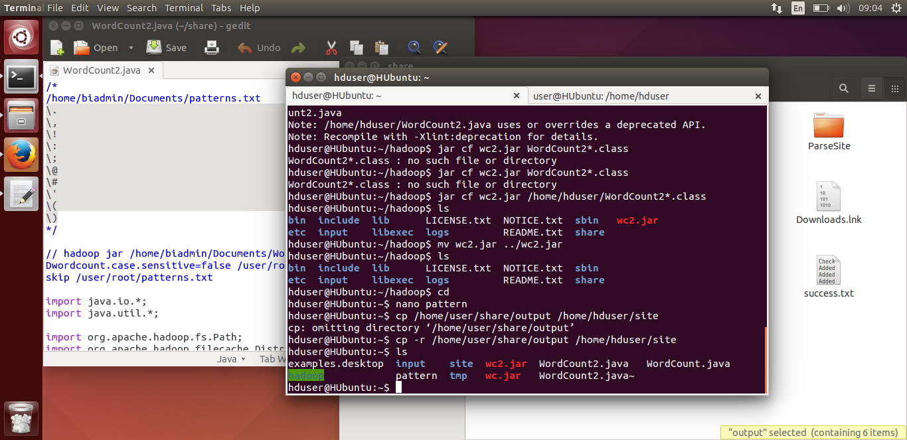
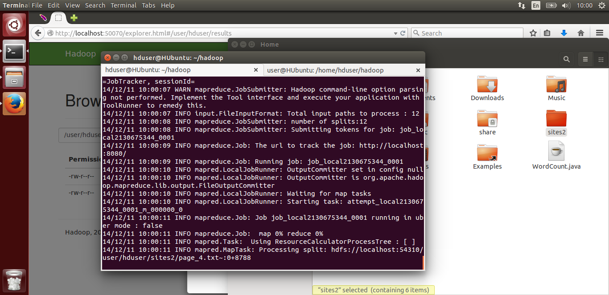
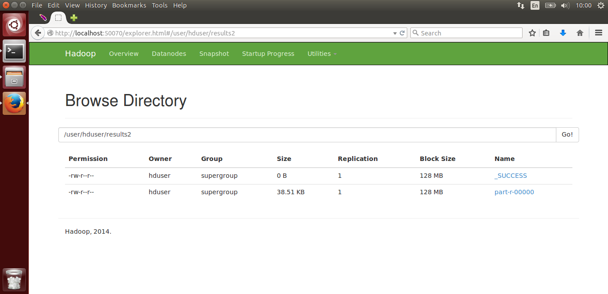
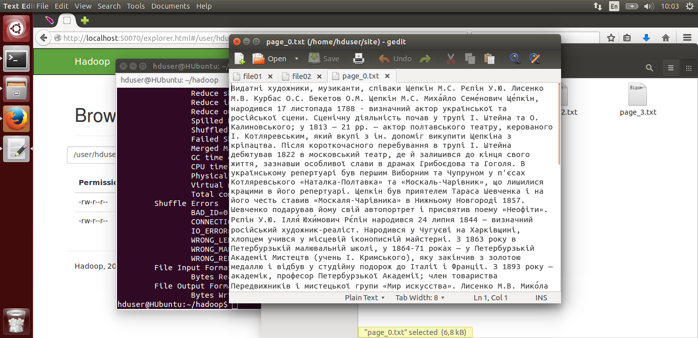
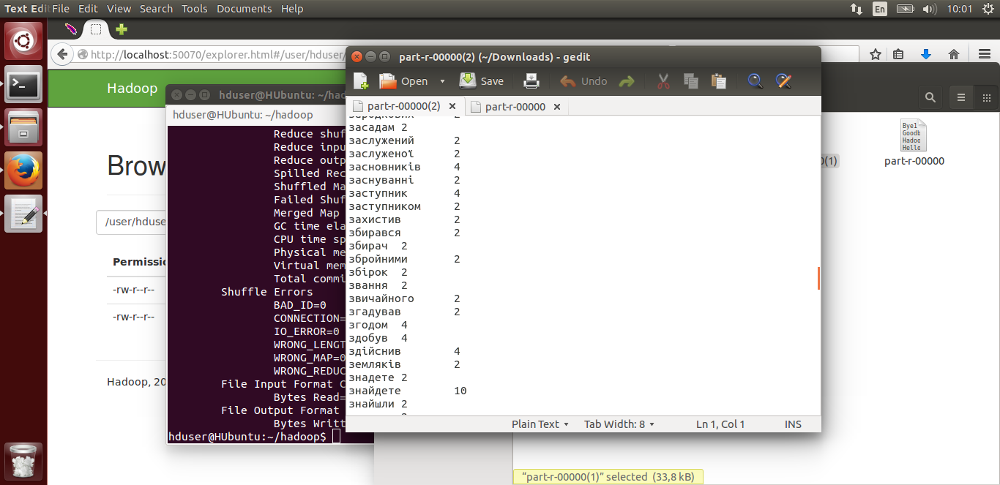

## Цель
Написать программу на Hadoop которая проходит по сохранившимся файлам с лабораторной работы №5 и создает обратный индекс для этих файлов.

## Вывод
В данной лабораторной работе мы выполняем все то же что и в 3-й лабораторной только добавим несколько исключений, а именно мы в mapperе мы удаляем символы ./,:;() и другие, которые могут нарушать точность подсчета слов.

## Скрины

